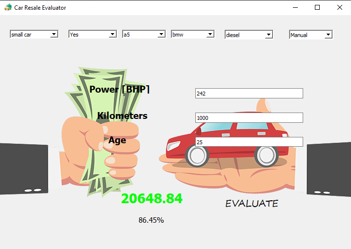

# Car-Resale-Evaluator

The above application uses regression algorithms on past data on pre-owned cars to predict the price of any car whose details are provided by the user using the graphical user interface. The GUI is built using the *QT* framework.

---

## Graphical User Interface

---

## Model Building

* Dataset used for this project : [cars_sampled.csv](https://drive.google.com/file/d/1SBXoQjDM_5vvpQeHssq2VGK36TbtJS6W/view)

Two different regression algorithms were applied for this problem:

* Logistic Regression
* Random Forests Regressor

Random forests algorithm was analysed to be more efficient than Logistic regression for this particular problem.

Data Analysis and Model building is provided in this [notebook](https://github.com/Nibba2018/Car-Resale-Evaluator/blob/master/Pre-owned%20Cars%20Analysis.ipynb).
